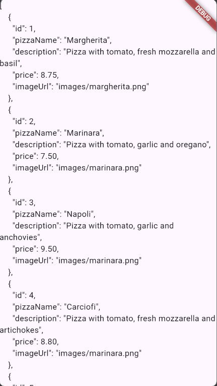
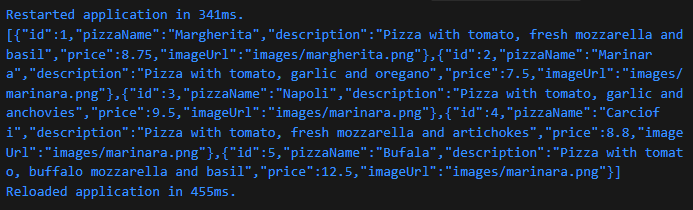
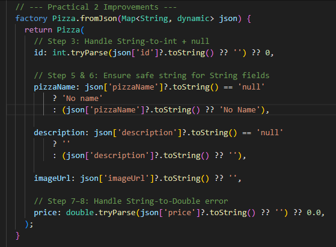
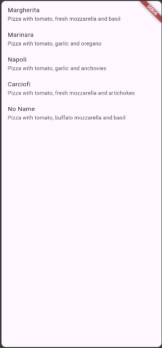
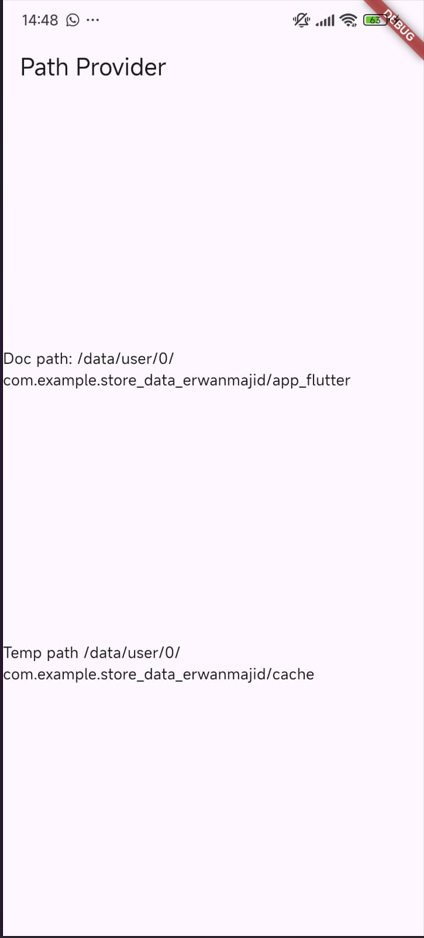
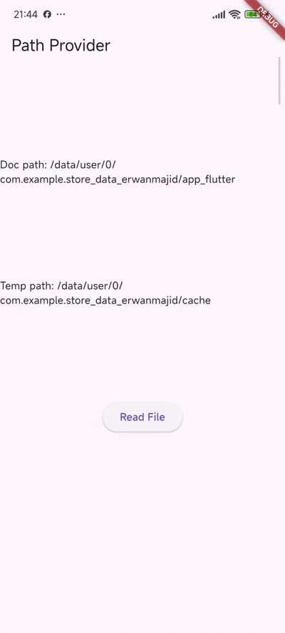

# Lab 1: Convert Dart model to JSON

## Question 1

- Add your nickname to titlethe app as an identity for your work.

- Change the application theme color according to your preference.

```.dart:
Widget build(BuildContext context) {
   return MaterialApp(
     title: 'Flutter JSON Demo Majid',
     theme: ThemeData(primarySwatch: Colors.yellow),
     home: const MyHomePage(),
   );
 }
```

## Question 2

- Include the screen capture results in your lab report



## Question 3

- Include the screen capture results in your lab report.




# Lab 2: Handle JSON data compatibility

## Question 4

- Capture the results of running your application, then import it into your lab report!





# Lab 3: Handling JSON errors

## Question 5

- Explain the meaning of safer and more maintainable code!

Safer code means the code includes protection against errors that might occur during runtime, such as empty values, "null" from an API, or mismatched data types. By adding checks and fallback values (like 0 for numbers or an empty string for text), the app won’t crash or behave unexpectedly when receiving bad data. This keeps the application stable even when the input isn’t perfect.

Meanwhile, more maintainable code means the code is written clearly, consistently, and in a way that’s easy to understand—both for other developers and for yourself in the future. Using constant keys like keyName or keyPrice helps avoid typing mistakes and makes changes easier; if the API structure changes, updating one place is enough. Following clean patterns and avoiding repeated logic makes the code more organized, easier to test, and faster to improve over time.

- Capture your lab results and attach them to the README.


# Lab 4: SharedPreferences

## Question 6

- Capture your practical results in GIF format and attach them to the README.


# Lab 5: Access the filesystem with path_provider

## Question 7

- Capture your lab results and attach them to the README.



# Lab 6: Accessing the filesystem with directories

## Question 8

- Explain the meaning of the code in steps 3 and 7!

### Step 3 — Meaning of writeFile()

This method writes text into a file stored in the app’s documents directory. It uses myFile.writeAsString() to save the text (which you replace with your full name and student ID). The method runs inside a try block so the app does not crash if an error occurs. If writing succeeds, it returns true; if it fails, it returns false.

### Step 7 — Meaning of the Run Process

When the app runs, the file is first created and written during initState(). After pressing the Read File button, the readFile() method reads the text from that file and updates fileText using setState(). The UI then refreshes and displays the written content—showing your name and student ID on the screen.

- Capture your practical results in GIF format and attach them to the README.


